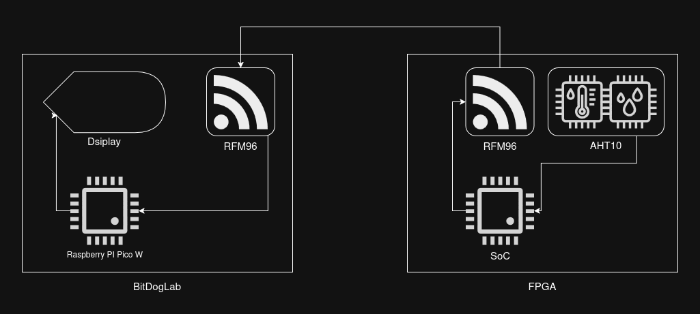

# Tarefa 05 – Transmissão de Dados via LoRa

Projeto da disciplina Embarcatech – FPGA

## 📡 Descrição do Projeto

Este projeto implementa um sistema de comunicação sem fio entre um SoC customizado rodando em uma FPGA ColorLight i9 e uma BitDogLab, utilizando módulos LoRa RFM96.

A FPGA atua como nó transmissor, lendo dados ambientais (temperatura e umidade) de um sensor AHT10 (I2C) e enviando-os periodicamente via LoRa (SPI).

A BitDogLab atua como nó receptor, recebendo os dados LoRa e exibindo as medições em um display OLED (I2C).

O projeto integra tanto o desenvolvimento de hardware (SoC LiteX) quanto o desenvolvimento de software (firmware bare-metal para o processador VexRiscv e código embarcado para a BitDogLab).

## ⚙️ Estrutura do Projeto
```bash
Tarefa-05-Embarcatech-FPGA/
│
├── fpga/                     # Arquivos relacionados ao SoC na ColorLight i9
│   ├── build/                # Bitstream e arquivos gerados pelo LiteX
│   ├── firmware/             # Código C bare-metal para o VexRiscv
│   └── scripts/              # Scripts Python de geração do SoC com LiteX
│
├── bitdoglab/                # Firmware da BitDogLab
│   ├── src/                  # Código-fonte principal
│   └── lib/                  # Bibliotecas LoRa e display
│
└── README.md                 # Este arquivo
```

## 🧠 Funcionamento do Sistema
FPGA (ColorLight i9)

Função: Nó transmissor LoRa.
Componentes principais:

- Core: VexRiscv

- SPI: Interface com o módulo LoRa RFM96

- I2C: Interface com o sensor AHT10

Fluxo de operação:

- Inicializa periféricos SPI e I2C.

- Lê temperatura e a envia pelo rfm96.

BitDogLab

Função: Nó receptor LoRa.
Componentes principais:

- LoRa RFM96 (SPI)

- Display OLED SSD1306 (I2C)

Fluxo de operação:

- Inicializa o módulo LoRa e o display.

- Recebe pacotes enviados pela FPGA.

- Extrai temperatura e umidade.

- Exibe as medições no OLED, atualizando conforme novas transmissões.

## 🔌 Conexões e Pinos Utilizados
### FPGA (ColorLight i9)

- Conector IDC (CNx) → LoRa (SPI)

-- MOSI, MISO, SCK, NSS, GND, 3V3

- Conector JST (I2C) → Sensor AHT10

-- SDA, SCL, GND, 3V3

BitDogLab

- IDC Central → Módulo LoRa (SPI)

- I2C → Display OLED SSD1306


## Diagrama de Blocos



